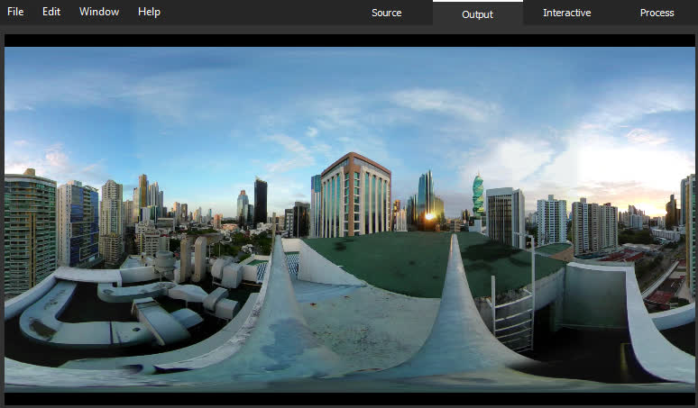
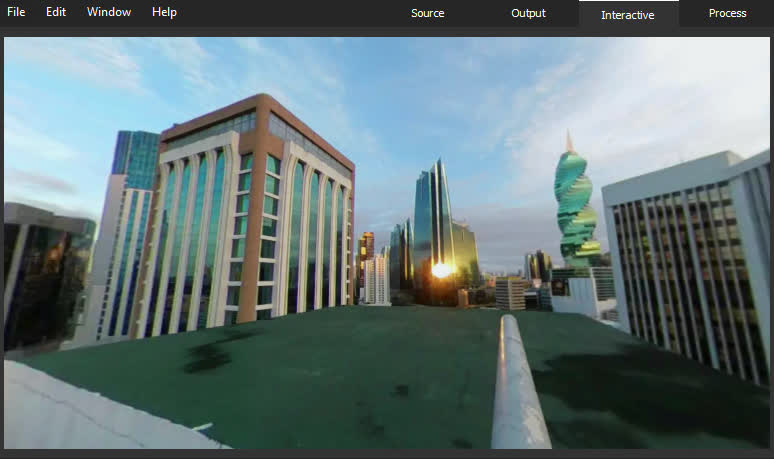
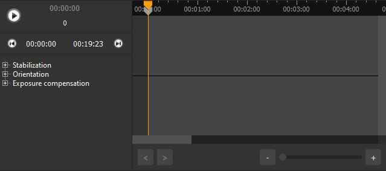
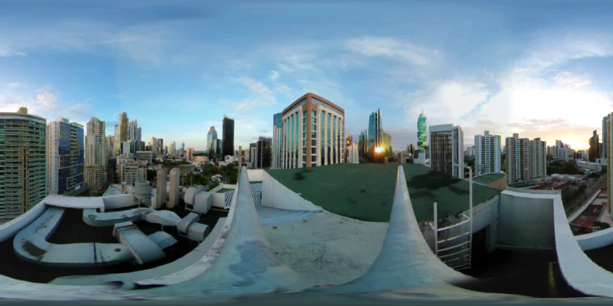
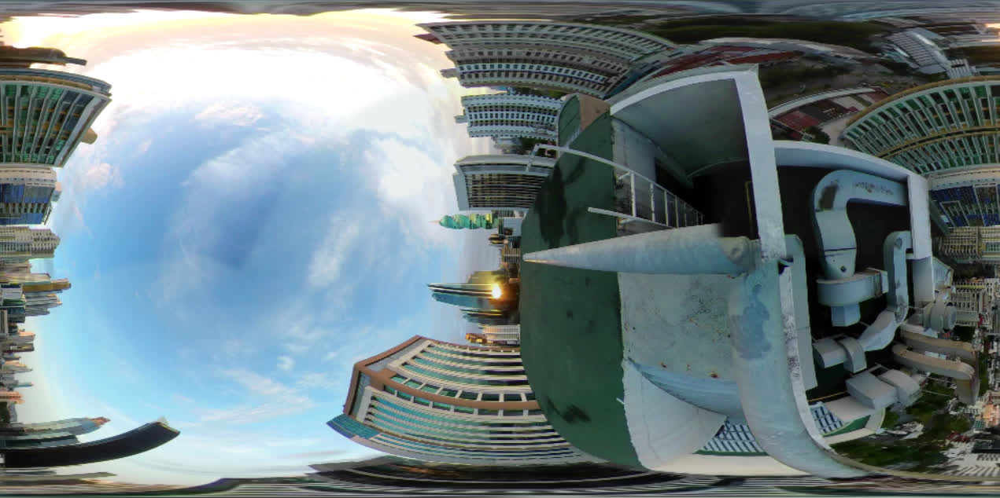
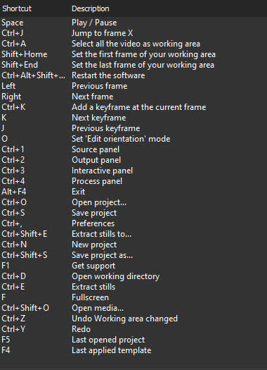

# VideoStitch Studio User Guide

**Table of contents**
- [Getting started with VideoStitch Studio](#getting-started-with-videostitch-studio)
  * [Starting a new project](#starting-a-new-project)
- [VideoStitch Studio user interface](#videostitch-studio-user-interface)
  * [VideoStitch Studio panels](#videostitch-studio-panels)
  * [Working with the timeline](#working-with-the-timeline)
  * [Project and system information](#project-and-system-information)
- [VideoStitch Studio workflow](#videostitch-studio-workflow)
  * [Synchronization](#synchronization)
    + [Automatic synchronization](#automatic-synchronization)
      - [Audio based synchronization](#audio-based-synchronization)
      - [Motion based synchronization](#motion-based-synchronization)
      - [Flash based synchronization](#flash-based-synchronization)
    + [Manual synchronization](#manual-synchronization)
  * [Calibration](#calibration)
    + [Automatic calibration](#automatic-calibration)
    + [Manual calibration](#manual-calibration)
  * [Color Correction](#color-correction)
    + [Photometric parameters](#photometric-parameters)
    + [Exposure compensation](#exposure-compensation)
    + [Manual Adjustments](#manual-adjustments)
  * [Stabilization & Orientation](#stabilization--orientation)
    + [Stabilization](#stabilization)
    + [Orientation](#orientation)
  * [Output configuration](#output-configuration)
  * [Output rendering](#output-rendering)
    + [General settings](#general-settings)
    + [Encoder settings](#encoder-settings)
    + [Audio settings](#audio-settings)
    + [Batch stitcher](#batch-stitcher)
- [Useful Tips & Troubleshooting](#useful-tips--troubleshooting)
    + [Building your own 360° camera rig](#building-your-own-360-camera-rig)
    + [Filming with a 360° camera rig](#filming-with-a-360-camera-rig)
    + [Working with VideoStitch Studio - Troubleshooting](#working-with-videostitch-studio---troubleshooting)
    + [Keyboard shortcuts](#keyboard-shortcuts)

# Getting started with VideoStitch Studio

## Starting a new project

To start a new project you need to import the videos you want to stitch.
There are two ways to do so:

- Add media by clicking on *File* > *Open media*

You then have to select the videos you want to stitch in the file explorer.

- Alternatively you can drag the videos you want to stitch from your file explorer and drop into VideoStitch Studio user interface.

After importing your media it will look like this and is listed in the *Source* panel:

# VideoStitch Studio user interface

## VideoStitch Studio panels

There are four panels in VideoStitch Studio

1. **Source:** Displays the input videos

2. **Output\*:** Shows the stitched result in realtime

3. **Interactive\*:** Shows the stitched result in real-time from an interactive perspective

4. **Process\*:** Video and Output settings can be adjusted in this panel

*Note: You can only see “Output“, “Interactive“ & “Process“ after importing media.*

*Output panel*  

*Interactive Panel*  

## Working with the timeline

The timeline of VideoStitch Studio allows you to preview your source videos and stitched result.
You can play, pause, select specific frames & time and set a working area.

**Play button** 
On the top left of the timeline you can find the Play button. Depending on the panel you are in you can either view the source videos or preview the stitched result in real time.

**Select working area** 
Below the Play button you will find two timecodes. By default the first one is 00:00:00 and the second is the total time of the video. Changing these values will limit the working area which allows you to start a video later or end earlier than the original source. You can also grab the grey markers and drag them to the desired position in the timeline.
Synchronization, calibration, exposure will only be calculated for the working area.

**Zooming in and out** 
For precise navigating in the timeline you can zoom in or out using the slider on the bottom right.
Zooming in also helps seeing the values for algorithms, like color correction more precisely.

**Navigating to the desired frame** 
If you want to view a specific frame you can use the Shortcut **Ctrl+J/Cmd+J**. You also zoom in as mentioned above and then drag the orange marker to the desired time and use the arrow keys to jump one frame forward or backward. **Shift+Home** and **Shift+End** will select the first / last frame of your current working area.

**Keyframes**  
Keyframes for Stabilization, Orientation & Color Correction are automatically created by VideoStitch Studio.
If you click on a keyframe marker on the timeline and drag it up or down this will affect the corresponding function (e.g. increasing or decreasing exposure).
If you want to add a new keyframe you can do so with the shortcut **Ctrl+K/Cmd+K**. You can jump between keyframes with the shortcuts **K** (next keyframe) and **J** (previous keyframe).

## Project and system information

At the bottom right of the interface, you will find more useful information:

1. Current output and preview size (2048*1024 by default when creating a project)
2. GPU (Graphics Processing Unit) memory currently used by VideoStitch Studio
3. Graphics card model and its GPU memory size
4. Rendered frame: The current frame selected in the timelime

# VideoStitch Studio workflow

## Synchronization

While most 360° camera setups are synchronized hardware-wise nowadays, synchronization still is needed for DIY rigs. If you are using a DIY rig and not a 360° camera, synchronization is the first step in the stitching process otherwise you can skip this step.

*For optimal synchronization keep the following in mind:*

- *Select the highest possible framerate (fps) in camera (60 should be the minimum if there are moving objects in the scene)*

- *Rolling shutter can create issues when dealing with scenes with fast moving objects.*

- *Make sure you think about syncronisation while shooting; a strong sound (e.g. clapping) or turning the whole camera 360° for motion based sync.*

To open the synchronization tool, navigate to the bar at the top, click on *Window* > *Synchronization*. The synchronization tool appears on the top left of the user interface.

### Automatic synchronization

*Note: For optimal results make sure to select an appropriate work area which includes either a specific sound, a motion, like turning the camera or the strong change of lighting in the scene depending on the synchronizing method you want to use.*

There are three different approches to synchronizing your source videos.

#### Audio based synchronization

Videos are being automatically synchronized based on a loud sound, that stands out from the background noise. A loud clap or a dog training clicker can create such sounds, but it is still not recommended for noisy environments. Make sure the sound is within the working area!

#### Motion based synchronization

Videos are being automatically synchronized based on a strong motion of the camera rig itself.
If your rig allows it, a short, but strong spin would be ideal for this synchronization method.
Make sure both, the start and end of the spin are within the working area.

#### Flash based synchronization

Videos are being automatically synchronized based on a sudden change in lighting that needs to be visible from all cameras.
Turning on bright lights in a room or using synchronized professional flashes would work for this method.
Make sure the change of lighting is within the working area.

### Manual synchronization

If your footage wasn't optimized for synchronization and it doesn't synchronize well enough with any of the automatic methods (ghosting on moving objects in the calibrated 360° panorama can be a sign for this) you can adjust the frame offset manually.
By clicking on *Manual* you will reach the Manual tab where you see the source video names and frame offset.

*badly synchronized / ghosting example*  

To get rid of the ghosting of moving objects in the 360° panorama go to a frame where you can clearly see the ghosting in the *Output* panel, enable input numbers (*Window* > *Output configuration* > *Show input numbers*), locate the source file that isn't synchronized well and the input number assigned to it and manually change the offset until no ghosting occurs. You can see the changes live in the *Output* and *Interactive* panel. Click play and see if there is any ghosting remaining – repeat if necessary.
You can also link source videos by clicking the checkbox on the right if you are certain some source videos are already synchronized. VideoStitch Studio will use this information to enhance the automatic synchronization.

## Calibration

**What is a calibration?** 
Calibration is essentially how the videos have to be moved around and stitched together to get a full 360° panorama. Make sure to synchronize your videos before heading to the *Calibration* tab.

VideoStitch Studio provides you an automatic calibration tool, but it is also possible to import a stitching template from PTGui or Hugin.

*before calibration (source videos)*

*stitched result after calibration (shown in *Output* panel)*

To open the calibration tool, navigate to the bar at the top, click on *Window* > *Calibration*. The calibration tool appears on the top left of the user interface.

### Automatic calibration

VideoStitch Studio is able to automatically calibrate your footage using custom camera settings.

**Custom parameters calibration** 
You can always try to keep everything on auto first.
If that doesn't give you a good result you should create a custom calibration:

1. Select the used lens type (e.g Fullframe fisheye for GoPro)

2. Specify the field-of-view (FOV) of your cameras (You'll most likely find this in your cameras manual or online!)

3. Click on *Calibrate on sequence*

**Crop source videos** 
You can crop source videos.
This is especially useful for when you are filming with high FOV lenses.
Our example project uses 3 inputs with a FOV of around 200°. You can adjust by grabbing the orange circle and drag it to the desired position. The size of the cropping circle can quickly be adjusted with the scroll wheel. In our example we can easily crop out the parts we don't want to use for our 360° video.

*Source Video*

*Cropped video*

**Manual frame selection** 
VideoStitch Studio will automatically choose frames from the calibration sequence you defined as reference for the calibration. If you want more control, you can calibrate on frames you select yourself.

*To calibrate using specified frames:*

1. Click on the *Manual frame selection* checkbox
2. Select a frame by placing the orange marker on the desired frame
3. Click on *Add frame*
4. Repeat steps 2 and 3 until you are satisfied with your frame list
5. Launch the calibration (*Calibrate*)

You can remove one or all frames by clicking on *Remove selected* and *Clear all*.

### Manual calibration

In some cases the automatic calibration might not be precise enough or doesn't work at all. There are multiple reasons for this; Objects close to the rig, not enough detail (e.g. blue sky) or not enough overlap between images.
To solve this VideoStitch Studio is compatible with templates from PTGui and Hugin – both are thrid party software solutions made specifically for stitching panoramic images.

***Note: VideoStitch Studio will import the exact position of every source file in the 360° sphere and all red masks. Most other adjustments will not be imported!
If you want to use masks make sure to only use the red masks.***

If you want to work with PTGui or Hugin you need to create the template using still images. VideoStitch Studio helps you with exporting images.
Go to *Edit* > *Extract stills to...* OR *Extract stills* and it will export image files you can use. Make sure to keep the names and order the same to be able to quickly apply the template in VideoStitch Studio once it is done.

In the Calibration window select *Import a template* > *Browse calibration...* and select the file in the file browser. If you have used a template in the past and want to use it again simply click on *Recent calibrations* and apply the desired one.

## Color Correction

Color correction optimizes the stitched 360° video by automatically adjusting vignetting, camera response curves, exposure and white balance. Depending on the videos you want to stitch you can also choose to only adjust some of the settings.

To open the color correction tool, navigate to the bar at the top, click on *Window* > *Color correction*. The color correction tool appears on the top left of the user interface.

### Photometric parameters

By clicking *Calibrate photometry* under *Photometric parameters* VideoStitch Studio will automatically calculate the response curves and vignetting of the used cameras to improve the blending of the stitched 360° panorama.

**Vignetting** describes the light fall-off in the frame; corners usually appear darker than the center. Darker edges and corners are sometimes wanted in photography, but it is a problem for stitching and blending videos together.

Explaining ***camera response*** would take to much time here, but is basically the relation between the amount of real world light coming in and the video pixel values the camera takes.

*Vignette* and *Camera response* tabs will appear under *Photometric parameters*.

### Exposure compensation

VideoStitch Studio automatically analyzes the input videos and calculates exposure and white balance adjustments.
You can choose to either *Adjust on current frame* or *Adjust sequence* which calculates a new exposure (and white balance if selected) at a specific frame interval and applies an interpolated exposure (and white balance) to frames in between.

**Example** 

**Advanced parameters** 
You can set advanced parameters by ticking the box next to *Advanced parameters*.

**Adjust every** 
Allows you to change the interval between each exposure (and white balance) adjustment, frames in between will be interpolated.

Depending on how the light changes in you scene a lower value will deliver better results, if the lighting doesn't change in your scene, setting a higher frame interval is okay, too.

**Anchor** 
Allows you to anchor the exposure to a specified source video that has the correct color (even lighting – not pointing to a bright light source or too dark area).
This specified source video will be used as a reference for the color correction.
You can also pick *All* and VideoStitch Studio will compare colors between source videos automatically.

### Manual Adjustments

You can manually adjust the exposure as well as the Red and  Blue correction by heading to the timeline, expanding the *Exposure compensation* window and manually dragging the keyframe markers up (increase exposure/correction value) or down (decrease exposure/correction value).

## Stabilization & Orientation

**Stabilization** is useful if your videos were not shot on a solid tripod. Drone or handheld footage without a gimbal are good examples, but sometimes even a tripod can shake if the environment is rather windy. Stabilizing will smooth out the movements and vertical bumping.

**Orientation** is used if the horizon in your stitched panorama isn't right. Straight vertical lines that look tilted in your stitched panorama are often a sign that you need to set the horizon right. You can also choose the starting perspective by rotating your panorama without adjusting the horizon.
Depending on how the cameras are arranged in your camera rig your panorama orientation might be completely wrong like in the panorama below.

**

*Wrong Orientation*

*Wrong Orientation, too*

To open the stabilization & orientation tool, navigate to the bar at the top, click on *Window* > *Stabilization & Orientation*. The stabilization & orientation tool appears on the top left of the user interface.

&nbsp;

### Stabilization

To stabilize the footage:

1. Set the working area you want to stabilize

2. Click on *Stabilize sequence*

*If you are not happy with the result you can set a different working area, click on *Reset sequence* and *Stabilize sequence* again.*

### Orientation

To change the orientation:

1. Select the frame on which you want to change the orientation

2. Click on *Adjust on current frame*

3. Click and drag your mouse on the output to straighten out the horizon and change orientation

*Select any frame for stationary footage, otherwise you have to make sure to select a frame where you can easily see certain points as references. (e.g. straight lines, trees, the ocean)*

You can also create custom keyframes to change the center of the panorama or keep the level if the horizon shifts in your scene.

## Output configuration

To open the output configuration tool, navigate to the bar at the top, click on *Window* > *Output configuration*. The output configuration tool appears on the top left of the user interface.

There are two options in the output configuration window:

**Show input numbers** overlays the assigned input number of each source video on the stitched panorama. Very helpful if you have to locate a certain source video for optimizing syncronization and problems that might occur.

**Blending** offers two options.
You can select the *blending method* and set it to either linear or multiband.
Linear will render faster and is especially usefull for previewing your stitched footage live, multiband offers a higher quality and will take longer to compute.

The *feathering* slider allows you to control how sharp or smooth the blending between source videos will be.
While a smoother blending is useful for scenes without sharp detail (e.g. blending blue sky) it might create some ghosting where parallax is visible. Sharp blending is useful for keeping all the detail (e.g. text or mosaic), some seames might look too hard.
Try to find the perfect level of sharpness for you scene by trying and checking in the live preview of the *Output* panel.

## Output rendering

To export your 360° video or change the preview resolution you have to go to the *Process* panel.

### General settings

**File** 
Change the output filename and path. The file is created in the same directory as your input videos by default. Click on *Browse* and you can select thelocation in the file explorer.

**Size** 
Resolution of the live-preview and output. Remember the output will always automatically be a 2:1 format as VideoStitch Studio will render a 360°x180° output.

By clicking *Set optimal size* VideoStitch Studio will pick the maximal true resolution for the panorama video without interpolation of pixels of the input images.
The optimal size may differ even if you always use the same rig. The reason for this is the difference in overlap for scenes with objects close by and open environments.

**Length** 
You can select if you want to output the whole video or just the current working area (*Process selected sequence*) .

### Encoder settings

**Format** 
Switch between ***MP4*** or ***MOV*** Video formats or export an image sequence as ***JPEG***, ***PNG*** or ***TIFF.***

**Codec** 
Choose your desired codec: ***ProRes***, ***H264***, ***MPEG2*** and ***Motion JPEG***.

**Profile** (ProRes) 
You can choose between Proxy, LT, Standard & High Quality. 
If you want to continue working on your 360° video in an editing software like Adobe Premiere or Davinci Resolve you usually want to export *High Quality*.

**Bitrate mode** (*H264, & MPEG2*) 
You can choose between VBR (variable bitrate) and CBR(constant bitrate).

**Bitrate** (*H264 & MPEG2*) 
*File size = bitrate (kilobits per second) \* duration* 
Higher bitrate means higher quality and bigger filesize. The value heavily depends on your desired platform; if you are exporting specifically for a certain VR headset you can usually find the right values online.

**Quality Scale** (Motion JPEG) 
You can drag the slider to choose between more quailty vs more compression.

**Advanced settings** 
If you enable advanced settings you will be able to customize the GOP and B-Frames number.  
If you don't know what this is either look it up or keep as is, as explaining it here would take (p)ages.

**Which encoding setting to pick?** 
Ask yourself what you are using your panorama video for; if you want to render a quick preview a small H264 is enough, if you want to edit your footage in an editing software like Adobe Premiere Pro or Davinci Resolve you need to export either a High Quality MOV or an image sequence for maximum quality.

### Audio settings

By default the audio settings are disabled, to activate the settings, click on the *Audio settings* checkbox.

**Source** 
Select which source videos audio you want to use.

**Codec** 
Choose if your audio should be in ***MP3*** or ***AAC***.

**Bitrate** 
Choose the bitrate of the Audio in kbps: **64**, **96**, **128**, **192**, **256**, **512**

**Sample rate** 
Sample rate is fixed to ***44100Hz*** for ***MP3*** output and ***48000Hz*** for ***AAC***

**Channel layout** 
VideoStitch Studio outputs Stereo audio.

### Batch stitcher

If you want to prepare multiple videos for stitching and stitch them all later you can select *Send to batch*. You will then be asked to create a copy of your project which is send to the VideoStitch Studio batch stitcher. You can close the current project and open the next, and also send it to the batch stitcher once done.

You can remove, reset or edit a project by right clicking on the project name in the batch stitcher.

# Useful Tips & Troubleshooting

### Building your own 360° camera rig

- Make sure the FOV is big enough to cover the whole sphere and there is enough overlap between videos.

- If possible it is advisable to build a synchronized rig, because even if your synchonization in VideoStich Studio is perfect there still is the offset between frames.

- Keep the desired output resolution in mind.

### Filming with a 360° camera rig

- Make sure to select the highest possible framerate for the resolution if your rig isn't synchronized in itself. This minimizes the offset between movements that happen in between frames.

- Make sure to look around and try to see exactly what your camera sees. Remember everything is visible!

- Hiding lighting is hard in 360° videos, but you can place a cylindrical light below your camera (at the tripod).

### Working with VideoStitch Studio - Troubleshooting

- **Live preview in Output and Interactive panel is very slow.** 
  	Try setting a lower *Size* in the *Process* panel.

- **I see ghosting, but can't figure out which source videos are affected.** 
   	Enable „Show input numbers“ in the „Output configuration“.

- **Clicking *Set optimal size* gives a different result for different scenes shot with the same camera rig.** 
  This is to be expected, as the stitching is dependend on the distance of objects to the camera because of  the overlap between videos. A shot on the ocean would 	deliver a smaller resolution than a shot in a small room, because there is less overlap in the small room.

- **The stitched 360° video is too bright / dark!** 
  While this can obviously be fixed in any video editing software you can also 	manually drag the exposure keyframes down / up for the stitched panorama to increase / decrese exposure.

- **I created a template in PTGui / Hugin, but my stitched video looks different in Videostitch Studio!** 
  Make sure to keep the import order just the same as in VideoStitch Studio.
  Keep in mind VideoStitch Studio imports the position of every source video and the red masks (mask out) from PTGui or Hugin, most other adjustments are not imported.

- **Stitchlines between images are looking to soft / hard!** 
  Head to the *Output configuration* window, go to *Blending* and adjust the *Feather* slider.

### Keyboard shortcuts

A list of all available keyboard shortcuts can be brought up by selecting *Help* > *Shortcuts* in the menu bar.

**Have fun creating breathtaking 360° content!**
